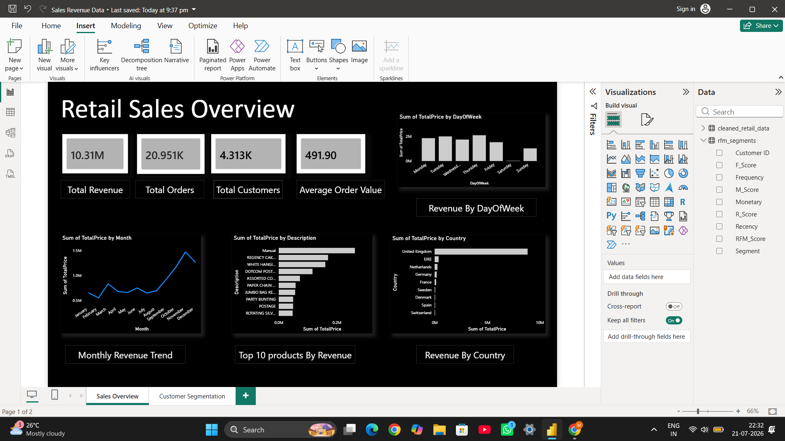
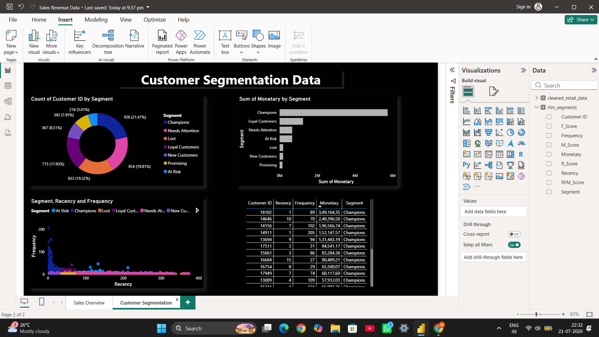

# Retail Sales & Customer Segmentation Analysis

An end-to-end data analytics project that cleans, analyzes, and visualizes real-world retail transaction data to uncover sales trends and segment customers using RFM (Recency, Frequency, Monetary) analysis — built with Python and Power BI.

## Business Problem

A UK-based online retailer needs to understand:
- How sales performed over time and which products/regions drive revenue
- Which customers are most valuable, and which are at risk of churning

This project answers both questions using transactional data and delivers an interactive dashboard for business stakeholders.

## Dataset

**Source:** [Online Retail II Dataset](https://archive.ics.uci.edu/dataset/502/online+retail+ii) — UCI Machine Learning Repository

Real transactional data from a UK-based online retailer (Dec 2009 – Dec 2010), containing ~525,000 records of invoices, products, quantities, prices, customer IDs, and countries.

## Tools & Skills Used

| Category | Tools |
|---|---|
| Data Cleaning & Analysis | Python (pandas, matplotlib) |
| Database Querying | SQL |
| Customer Segmentation | RFM Analysis (Python) |
| Dashboard & Visualization | Power BI (DAX, Power Query) |

## Project Workflow

1. **Data Cleaning** — Removed cancelled orders, missing product descriptions, and invalid (negative/zero) prices and quantities from ~525K raw records, resulting in ~511K clean transaction records.
2. **Exploratory Data Analysis** — Analyzed monthly revenue trends, top-selling products, revenue by country, and revenue by day of week.
3. **RFM Customer Segmentation** — Calculated Recency, Frequency, and Monetary value for 4,312 unique customers, scored each on a 1–5 scale, and classified them into actionable segments (Champions, Loyal Customers, At Risk, Lost, etc.).
4. **Dashboard Development** — Built a two-page interactive Power BI dashboard covering Sales Overview and Customer Segmentation.

## Key Insights

- **Seasonality:** Revenue is fairly stable (£550K–£830K/month) most of the year, climbing sharply from September and peaking at **£1.47M in November**, driven by pre-Christmas demand.
- **Pareto effect in customers:** Champions make up only **~21% of customers** (926 of 4,312) but generate **~56% of total customer revenue (~£5.7M)** — a small group of loyal customers drives the majority of the business.
- **At-Risk high spenders:** A smaller segment of "At Risk" customers (216 people) has an average spend of **£3,088** each — nearly double a typical Loyal customer — making them a priority for win-back campaigns despite their small size.
- **Operational pattern, not demand signal:** Revenue by day of week showed an anomalous near-zero value on Saturdays. Investigation revealed only 1 unique Saturday date with any transactions across the ~53-week dataset, confirming the business does not process orders on Saturdays — an operational insight rather than a customer behavior pattern.
- **Data quality caveat:** December 2010 revenue appears to drop sharply, but this reflects incomplete data (the dataset ends December 9, 2010), not an actual sales decline.

## Dashboard Preview

### Page 1: Sales Overview


KPIs (Total Revenue, Total Orders, Total Customers, Average Order Value), monthly revenue trend, top 10 products, revenue by country, and revenue by day of week.

### Page 2: Customer Segmentation


Customer distribution by RFM segment, revenue contribution by segment, a Recency vs. Frequency scatter plot colored by segment, and a detailed table of top individual customers.

## Repository Structure

```
retail-sales-customer-segmentation/
├── data/
│   ├── raw/                       # Original unprocessed dataset
│   └── processed/                 # Cleaned data + RFM segments (CSV)
├── notebooks/
│   └── retail_analysis.ipynb      # Full Python cleaning, EDA & RFM analysis
├── dashboard/
│   ├── retail_sales_dashboard.pbix
│   ├── sales_overview.png
│   └── customer_segmentation.png
└── README.md
```

## How to Run This Project

1. Clone this repository
2. Open `notebooks/retail_analysis.ipynb` in Jupyter or Google Colab to see the full data cleaning, EDA, and RFM segmentation process
3. Open `dashboard/retail_sales_dashboard.pbix` in Power BI Desktop to explore the interactive dashboard

## Future Improvements

- Automate data refresh with a scheduled pipeline
- Add a demand forecasting model for inventory planning
- Deploy the dashboard to Power BI Service for online sharing

---

**Author:** Mahendra Ankala
*Final-year B.Tech AI & Data Science student | Aspiring Data Analyst*
